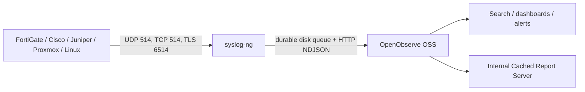

# Central Logging Platform

Single-node, Docker-based central logging for Ubuntu Server 24.04. It receives syslog with syslog-ng and forwards structured JSON over HTTP to OpenObserve OSS. OpenObserve's deprecated native syslog receiver is not used.



## Deploy

On a fresh Ubuntu Server 24.04 VM with at least 4 vCPU, 16 GiB RAM, and a mounted log disk:

```bash
git clone <your-repository-url>
cd central-logging-platform
sudo ./install.sh
```

The installer is idempotent. It validates the OS, CPU/RAM, ports, free space and Docker; installs Docker from Docker's official apt repository only when necessary; creates `/opt/logging-platform` and `/opt/logging-data`; generates a root password once; validates config; pulls pinned images; and starts the services. It does not partition disks, change networking, SSH, DNS, AppArmor, or UFW. If UFW is already active, it prints the ports to allow but changes no rules.

Set a different data location before installation if the separate disk is mounted elsewhere:

```bash
sudo DATA_DIR=/srv/logging-data ./install.sh
```

OpenObserve starts on HTTP `http://SERVER:5080`; put a TLS reverse proxy in front before exposing its browser login outside a trusted management network. The root credential is stored mode `0600` in `/opt/logging-platform/.env`.

## Ports and storage

| Port | Protocol | Purpose |
|---|---|---|
| 5080 | TCP | OpenObserve UI/API |
| 514 | UDP/TCP | Syslog listeners |
| 6514 | TCP/TLS | Syslog over TLS, after TLS is enabled |

OpenObserve data, SQLite metadata, WAL, and stream data live under `${DATA_DIR}/openobserve`. syslog-ng state and reliable queues live under `${DATA_DIR}/syslog-ng`. `SYSLOG_DISK_BUFFER_BYTES_PER_STREAM` is applied to each syslog-ng HTTP worker queue, not as one global or per-stream filesystem limit. Because `prealloc(yes)` reserves each queue immediately and old worker queues remain persistent, inspect the real allocation with `du -sh ${DATA_DIR}/syslog-ng/buffer`; the current four-worker deployment reserves about 25 GiB. Container logs are capped at 20 MiB × 5 files per container.

Global OpenObserve retention is `ZO_COMPACT_DATA_RETENTION_DAYS=30`. Per-stream retention can later be set in the UI. The host, containers, and timezone-less syslog source default to `America/Toronto`, which follows EST/EDT automatically. OpenObserve stores parsed instants in UTC; `received_at` retains collector receipt time. An RFC5424/FortiGate timestamp containing an explicit offset wins over the collector default. Set each device's NTP and timezone correctly.

The installer enables `logging-platform-storage-check.timer`, which checks the data filesystem every five minutes. Defaults are 75% warning and 85% critical through `STORAGE_WARNING_PERCENT` and `STORAGE_CRITICAL_PERCENT`. It writes only state transitions to syslog, exposes the current result in `status.sh`, and makes `healthcheck.sh` fail at warning/critical. It never deletes data or changes retention. Inspect it with `systemctl status logging-platform-storage-check.timer` and `journalctl -t logging-platform-storage`.

## Add or remove a device

Edit `config/sources.yml` with the device's fixed source IP, then validate before applying it:

```bash
sudo -i
cd /opt/logging-platform
editor config/sources.yml
./scripts/validate.sh && docker compose up -d syslog-ng
```

The mapping—not fragile content guessing—selects `fortigate`, `cisco`, `juniper`, `proxmox_ve`, `proxmox_mail_gateway`, `linux`, or `ubersmith`. Unmapped source IPs always go to `unclassified`. The current syslog source natively accepts RFC3164 and RFC5424. Every record includes `raw_message`, `source.ip`, syslog fields, timestamps, normalized observer/device fields, and stream. FortiGate key/value fields are parsed from the preserved frame and kept as `fortigate.*`; no parser failure discards a message.

The parsers deliberately remain conservative. Every FortiGate key/value field is retained, including application control, IPS, antivirus, web/DNS filter, DLP, SSL, WAF and related UTM fields, while parser non-matches remain valid events. PMG records retain queue IDs for query-time correlation rather than fabricating cross-event mail joins. Junos enrichment covers event mnemonics, interfaces, peers/VRFs, users and common SRX flow fields. Proxmox VE enrichment covers authentication, task UPIDs, VM/CT IDs and node/task/user segments while retaining ordinary Debian service records.

## Operations

```bash
./scripts/status.sh
./scripts/healthcheck.sh
./scripts/test-ingestion.sh fortigate
./scripts/test-syslog.sh [collector-host]
./scripts/test-buffering.sh
./tests/test-vendor-parsers.sh
./scripts/provision-dashboards.py
./scripts/provision-gui.py
./scripts/backup.sh [/safe/path/backup.tar.gz]
sudo ./scripts/update.sh --check
```

`validate.sh` checks source mappings, TLS assets, environment permissions/data paths, Compose syntax and syslog-ng syntax before restart. `test-buffering.sh` stops only this project's OpenObserve service, injects logs, checks a persistent queue file, restores OpenObserve, and waits for health; it never deletes stored logs. Backup captures configuration and local metadata when available, **not** raw stream data/WAL or queued messages. Restore stops this project, asks for literal confirmation, overlays the archive, validates, and restarts.

`tests/test-vendor-parsers.sh` runs the Juniper and Proxmox sample corpus through
the pinned syslog-ng image and asserts the important extracted fields. Set
`RUN_VENDOR_PARSER_TESTS=true` when running `validate.sh` to include it in the
full validation pass.

For a controlled upgrade, run `sudo ./scripts/update.sh --check` to resolve official stable channels into candidate immutable digests, review release notes, then run `sudo ./scripts/update.sh --apply`. It saves a protected timestamped `.env` backup, validates configuration, updates this Compose project, and waits for health. Add `--docker-engine` only when you explicitly want Docker packages updated from Docker’s official apt repository. There is no Watchtower or automatic update mechanism.

## TLS syslog

TLS is disabled until a usable certificate exists, avoiding a listener with a test certificate nobody trusts. For a lab CA:

```bash
./scripts/generate-syslog-cert.sh
sed -i 's/^ENABLE_SYSLOG_TLS=false/ENABLE_SYSLOG_TLS=true/' .env
./scripts/validate.sh && docker compose up -d syslog-ng
```

For production, replace `syslog-ng/tls/server.key`, `server.crt`, and the trust material in `syslog-ng/tls/ca/` with the company-issued server certificate/key and issuing CA. Private keys are ignored by Git and should stay mode `0600`. The current TLS listener uses optional client authentication; devices validate the collector certificate. Do not set insecure certificate-verification bypasses on devices.

## Reporting and starter searches

The upstream Report Server runs internally and generates four active **Cached Reports**: daily PMG, weekly FortiGate, weekly infrastructure, and weekly unknown-source reporting. They have no destination, so no report is emailed or transmitted outside the platform. Log in and use **Reports → Cached** or the corresponding live dashboard when review is required. Cached reports warm the dashboard output; they are not a permanent PDF archive.

The report service has no exposed host port. Its localhost SMTP defaults exist only because the upstream binary parses SMTP settings at startup; nothing is listening there for external delivery. To add email later, explicitly configure the SMTP variables in `.env`, attach tested recipients, and convert only the desired reports to scheduled/shared reports. This package uses OpenObserve OSS and does not install Enterprise.

Run `./scripts/provision-dashboards.py` to idempotently create or update the bundled **Central Logging Overview**, **PMG Mail Reporting**, **PMG Message Investigation**, **PMG to Ubersmith Mail Handoff**, **FortiGate Security & Traffic**, **FortiGate Event Investigation**, **Juniper Router Operations**, **Proxmox VE Operations**, **Ubersmith Billing Operations**, and **Unclassified Source Discovery** dashboards through OpenObserve's supported API. Each vendor remains isolated by dashboard and stream. Reporting summaries are separate from the PMG and FortiGate investigation workflows. PMG investigation provides a deterministic sender/recipient address table filter; FortiGate investigation exposes source/destination IP, user, session, policy, VDOM and content inputs. Every table uses the full dashboard width, paginates 50 rows at a time, and exposes client-side funnel filters on each column, so exact IDs, addresses, users, hosts, interfaces, policies, statuses, and free-text values can be narrowed without rerunning the whole dashboard. The Ubersmith handoff view correlates factual RFC Message-ID and Postfix queue evidence but does not claim application ingestion or ticket creation until Ubersmith emits a shared mail/ticket identifier. The vendor dashboards have a query-backed Device selector (Source IP for unclassified logs); the `<ALL>` selection intentionally removes that restriction. Every dashboard defaults to a responsive six-hour time range and is grouped into a purpose-specific GUI folder.

`./scripts/provision-gui.py` validates and provisions 12 saved investigation views, conservative exact-match/Bloom/full-text stream search fields, and four active destination-less cached reports. It never changes retention or partitioning. Use `--skip-stream-settings` or `--skip-reports` to omit those parts. See [OpenObserve GUI enhancements](docs/GUI-ENHANCEMENTS.md) for the complete inventory and operating notes. Never manipulate OpenObserve SQLite directly.

Alert provisioning is intentionally deferred. No alert, destination, or workflow is created by the installer.

## Source guidance and limits

Use TCP where a device supports it, and TLS only after certificates are deployed. Traffic/session logging can consume substantially more than 250 GB/month; selectively enable FortiGate traffic and UTM logs based on troubleshooting needs. See [FortiGate](docs/FORTIGATE.md), [FortiManager/FortiAnalyzer](docs/FORTIMANAGER.md), [Cisco](docs/CISCO.md), [Juniper](docs/JUNIPER.md), [Proxmox VE](docs/PROXMOX-VE.md), [PMG](docs/PMG.md), [Linux](docs/LINUX.md), [Ubersmith](docs/UBERSMITH.md), and [Unclassified source discovery](docs/UNCLASSIFIED.md). Upstream source links and exact capabilities are recorded in [docs/REFERENCES.md](docs/REFERENCES.md).
